# DMS Architecture Documentation

## Table of Contents

1. [System Overview](#system-overview)
2. [Microservices Architecture](#microservices-architecture)
3. [Service Details](#service-details)
4. [Data Flow](#data-flow)
5. [Security Architecture](#security-architecture)
6. [Deployment Architecture](#deployment-architecture)
7. [Integration Patterns](#integration-patterns)

---

## System Overview

The Document Management System (DMS) is a cloud-native, microservices-based platform built on Azure Kubernetes Service (AKS) with Istio service mesh for secure inter-service communication.

### High-Level Architecture

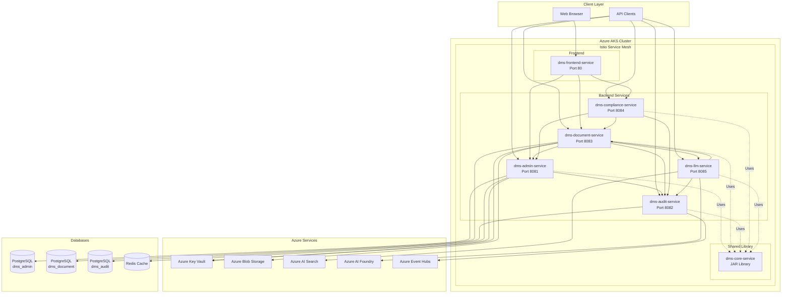

---

## Microservices Architecture

### Service Independence

Each microservice is independently deployable with its own:
- Database schema
- Configuration
- Deployment artifacts
- Health checks

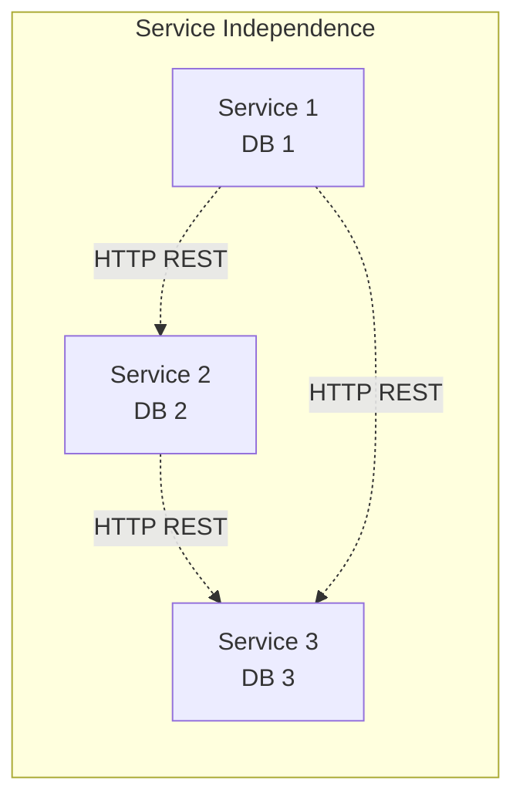

### Service Communication

Services communicate via:
- **Synchronous**: REST APIs over HTTP/HTTPS
- **Asynchronous**: Azure Event Hubs (for audit events)
- **Service Discovery**: Kubernetes DNS

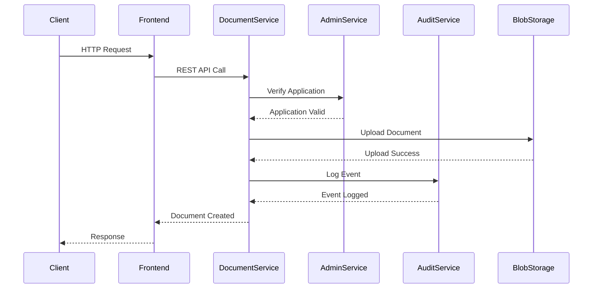

---

## Service Details

### dms-core-service (Shared Library)

**Type**: Maven Library (JAR)  
**Purpose**: Common components shared across services

**Components**:
- Security configurations (JWT converter, base security)
- Key Vault integration
- Common utilities (JSON converter, credential service)
- Shared exceptions
- Common DTOs
- Audit event client

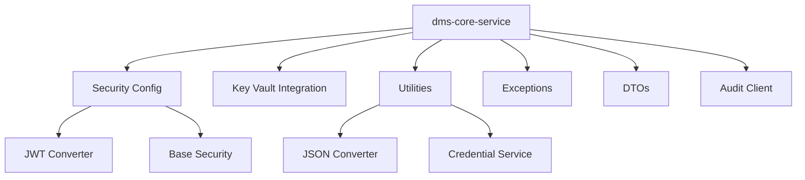

### dms-admin-service

**Port**: 8081  
**Database**: `dms_admin` (PostgreSQL)  
**Purpose**: User, role, permission, and application management

**Endpoints**:
- `/api/v1/admin/users` - User management
- `/api/v1/admin/roles` - Role management
- `/api/v1/admin/permissions` - Permission management
- `/api/v1/admin/applications` - Application management
- `/api/v1/admin/dashboard` - Admin dashboard

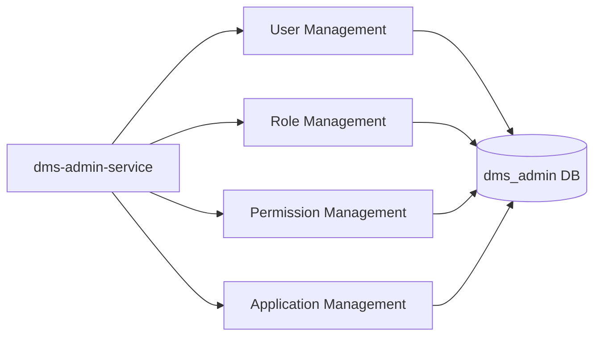

### dms-document-service

**Port**: 8083  
**Database**: `dms_document` (PostgreSQL)  
**Purpose**: Document CRUD operations and versioning

**Endpoints**:
- `/api/v1/documents` - Document operations
- `/api/v1/documents/{id}/versions` - Version management
- `/api/v1/documents/{id}/download` - Document download

**Dependencies**:
- Azure Blob Storage (document storage)
- Admin Service (application verification)
- Audit Service (logging)
- LLM Service (embeddings)

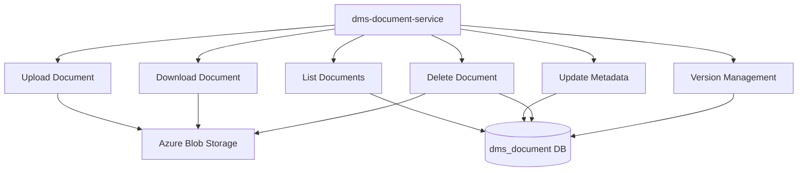

### dms-audit-service

**Port**: 8082  
**Database**: `dms_audit` (PostgreSQL, partitioned)  
**Purpose**: Centralized audit logging

**Features**:
- Receives audit events from all services
- Stores in partitioned PostgreSQL database
- Publishes to Azure Event Hubs
- Query API for audit logs

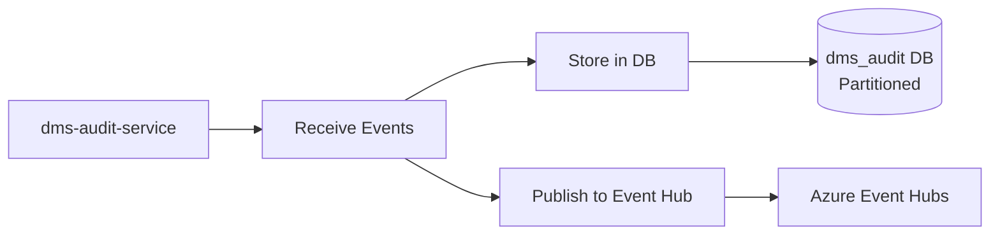

### dms-compliance-service

**Port**: 8084  
**Database**: None (stateless)  
**Purpose**: Compliance framework (PCI-DSS, GDPR, ISO 27001)

**Endpoints**:
- `/api/v1/compliance/pci/report` - PCI compliance reports
- `/api/v1/compliance/gdpr/data-subject/{id}` - GDPR data export
- `/api/v1/compliance/gdpr/data-subject/{id}` (DELETE) - GDPR erasure
- `/api/v1/compliance/iso27001/controls` - ISO 27001 controls

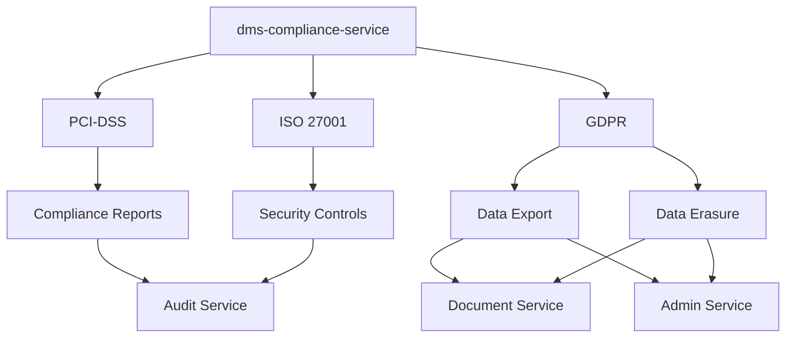

### dms-llm-service

**Port**: 8085  
**Database**: None (uses Azure AI Search)  
**Purpose**: AI/LLM integration for document queries

**Endpoints**:
- `/api/v1/llm/query` - Natural language document queries
- `/api/v1/llm/compliance-check` - Compliance-focused queries

**Dependencies**:
- Azure AI Search (vector search)
- Azure AI Foundry (LLM models)
- Document Service (document metadata)
- Audit Service (query logging)

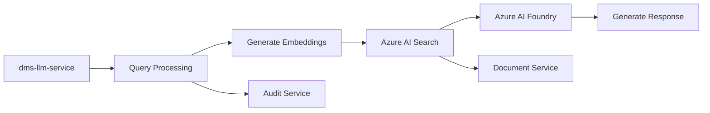

### dms-frontend-service

**Port**: 80  
**Type**: Angular 21 SPA  
**Purpose**: User interface for all DMS functionality

**Features**:
- MSAL authentication (Azure AD)
- Document management UI
- Admin dashboard
- Compliance reporting UI
- LLM query interface

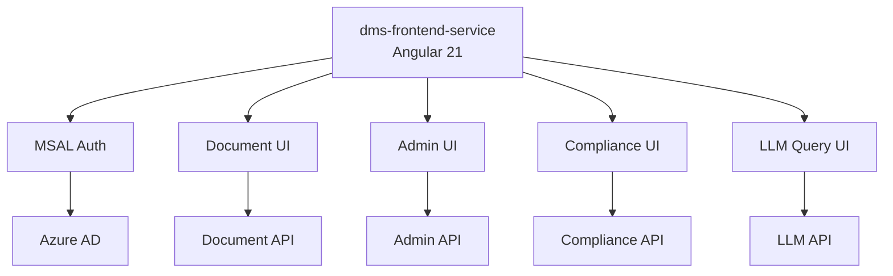

---

## Data Flow

### Document Upload Flow

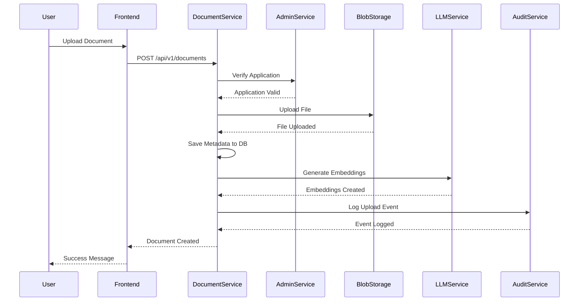

### Document Query Flow (LLM)

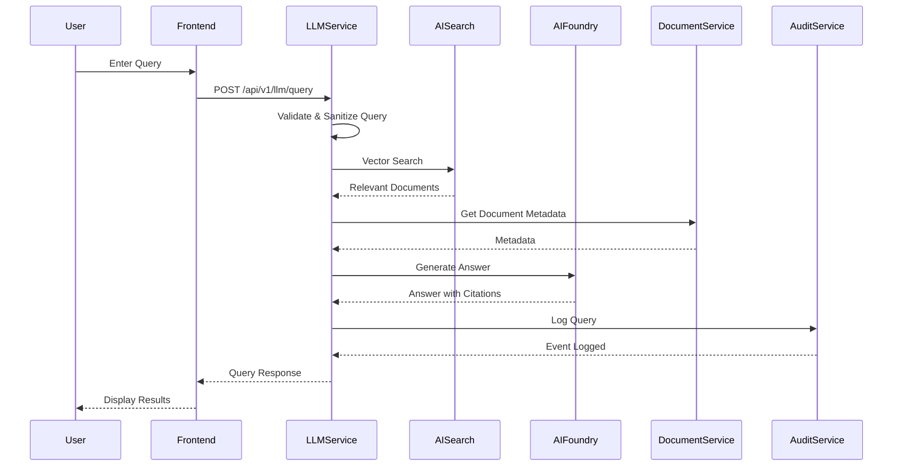

### User Management Flow

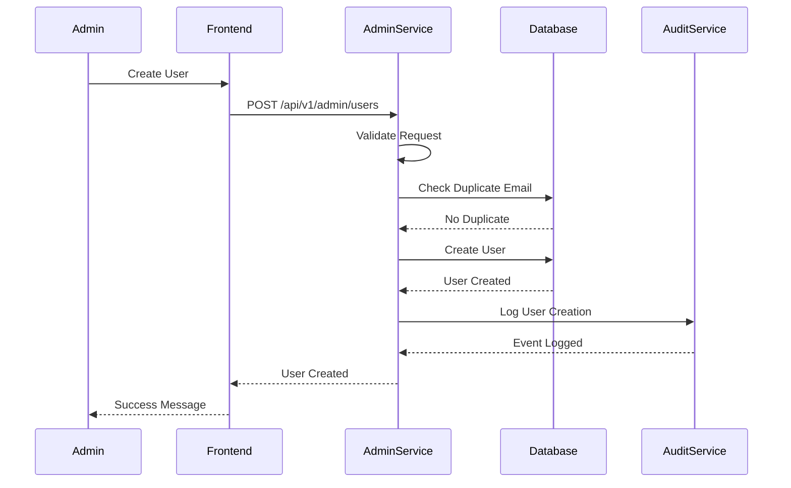

---

## Security Architecture

### Authentication Flow

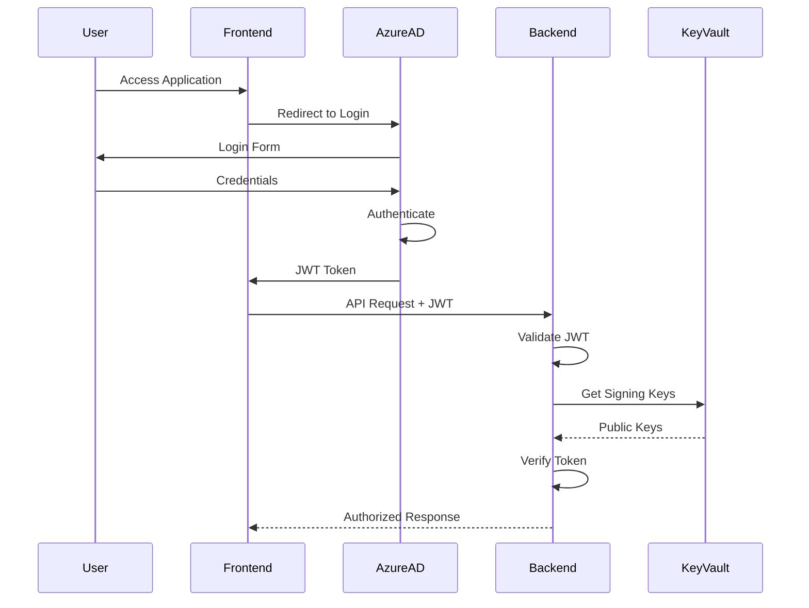

### Application Isolation

```mermaid
graph TD
    REQ[Incoming Request]
    REQ --> JWT[Extract JWT]
    JWT --> APP_ID[Extract Application ID]
    APP_ID --> FILTER[ApplicationIsolationFilter]
    FILTER --> CONTEXT[Set Application Context]
    CONTEXT --> SERVICE[Service Processing]
    SERVICE --> STORAGE[Application-Scoped Storage]
    SERVICE --> DB[Application-Scoped DB Queries]
    
    STORAGE --> BLOB[Blob Container<br/>app-{id}-documents]
    DB --> WHERE[WHERE application_id = {id}]
```

### RBAC Permission Flow

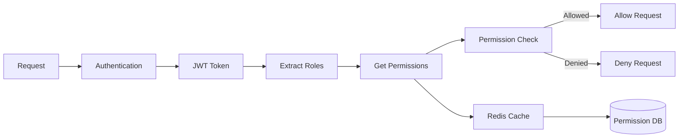

---

## Deployment Architecture

### Kubernetes Deployment

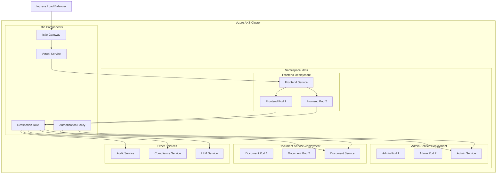

### Flux GitOps Flow

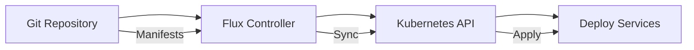

---

## Integration Patterns

### Service-to-Service Communication

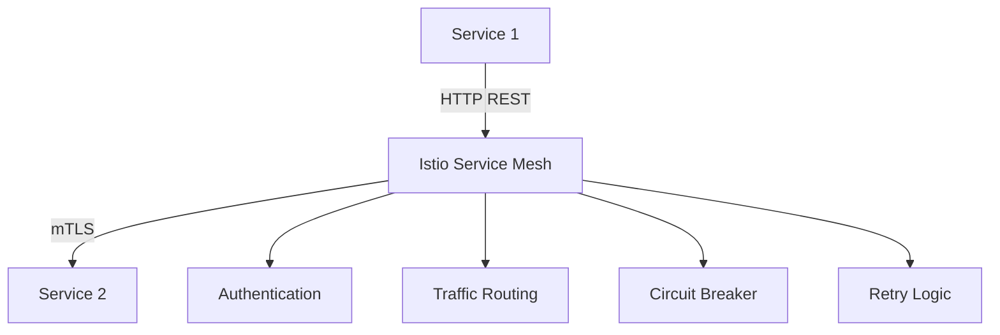

### Event-Driven Architecture

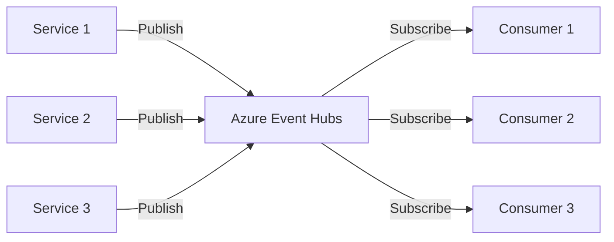

### Database Per Service Pattern

```mermaid
graph TD
    ADMIN_SVC[Admin Service] --> ADMIN_DB[(Admin DB)]
    DOC_SVC[Document Service] --> DOC_DB[(Document DB)]
    AUDIT_SVC[Audit Service] --> AUDIT_DB[(Audit DB)]
    
    ADMIN_DB -.->|Independent| DOC_DB
    DOC_DB -.->|Independent| AUDIT_DB
```

---

## Technology Stack Summary

| Component | Technology |
|-----------|-----------|
| **Language** | Java 25 LTS |
| **Framework** | Spring Boot 3.4.x |
| **Frontend** | Angular 21 |
| **Database** | PostgreSQL 16.x |
| **Cache** | Redis 7.x |
| **Container Orchestration** | Kubernetes 1.28+ |
| **Service Mesh** | Istio |
| **GitOps** | Flux |
| **Cloud Platform** | Azure AKS |
| **Storage** | Azure Blob Storage |
| **AI Services** | Azure AI Search, Azure AI Foundry |
| **Messaging** | Azure Event Hubs |
| **Secrets** | Azure Key Vault |

---

*Last Updated: 2024*
